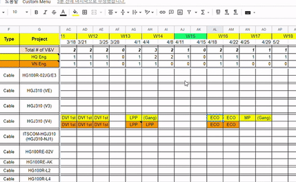

# Project : Software Quality Validation Activity Schedule Management Helper

    
     
    

## Purpose & Description
Humax-Networks is using Google Spreadsheet to manage internal software validation plans usually per week for each project.
Sometimes it needs to check the number of requested software validations per week in case of multi-request occurrence.
With that situation, Google Spreadsheet cannot update macros automatically when compares to Microsoft Office Excel.
To solve this inconvenience, Google Apps Script has been used to make some scripts run automatically as a trigger when some cells' data changes.
And plus, some scripts for updating a current week range as a different color also has added when the page is refreshed.

## Used major technique
- Google Apps Script
